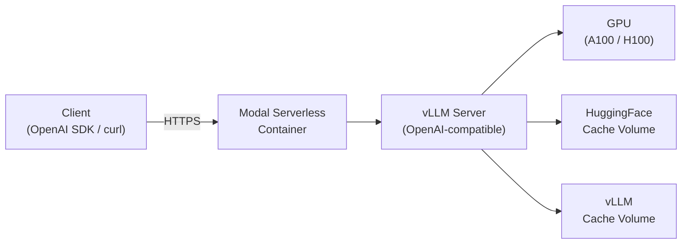

# Phi-4-mini-instruct — Modal Deployment

Production-ready serverless deployment of **[Microsoft Phi-4-mini-instruct](https://huggingface.co/microsoft/Phi-4-mini-instruct)** (3.8B parameters, 128K context) on [Modal](https://modal.com) using [vLLM](https://docs.vllm.ai). Exposes a fully **OpenAI-compatible API** with streaming support.

## Architecture



**How it works:**

1. Modal spins up a container with CUDA 12.9 + vLLM pre-installed
2. Model weights are downloaded from HuggingFace and cached in a persistent Modal Volume
3. vLLM serves the model as an OpenAI-compatible API (`/v1/chat/completions`, `/v1/models`, etc.)
4. Modal handles auto-scaling, GPU allocation, and container lifecycle
5. Containers scale to zero when idle — you only pay for active compute

## Prerequisites

| Requirement | Details |
|---|---|
| **Modal Account** | [Sign up](https://modal.com) — includes free credits |
| **Modal CLI** | `pip install modal` then `modal setup` |
| **uv** | [Install](https://docs.astral.sh/uv/getting-started/installation/) |
| **Python** | 3.12+ |
| **HuggingFace Token** | Optional — Phi-4-mini-instruct is public, but speeds up downloads. Set via `modal secret create huggingface-secret HF_TOKEN=<your-token>` |
| **Observability Secret** | Required for Grafana Cloud export. Create a Modal secret named `grafana-cloud-observability` or set `MODAL_OBSERVABILITY_SECRET_NAME` before deploy. Modal uses the OTLP keys from this secret. |

## Quick Start

### 1. Install dependencies

```bash
cd modal_deployment
uv sync
```

### 2. Deploy to Modal

```bash
modal deploy app.py
```

This will:
- Build the container image (first time takes ~5 min for vLLM install)
- Download the model weights (~7.6 GB)
- Deploy the server and print the live URL

### 2a. Configure observability secrets

Create a single Modal secret containing the credentials Modal should inject into both vLLM endpoints for observability export.

Modal consumes the `OTEL_*` keys directly. If you also want to keep your Grafana Cloud Prometheus/Loki connection values in the same secret for convenience, you can store those too:

```bash
modal secret create grafana-cloud-observability \
  OTEL_EXPORTER_OTLP_ENDPOINT=https://<your-grafana-cloud-otlp-endpoint> \
  OTEL_EXPORTER_OTLP_HEADERS="Authorization=Basic <base64-username-colon-api-key>" \
  GRAFANA_CLOUD_PROM_REMOTE_WRITE_URL=https://prometheus-prod-<region>.grafana.net/api/prom \
  GRAFANA_CLOUD_PROM_USERNAME=<prometheus-username> \
  GRAFANA_CLOUD_PROM_API_KEY=<prometheus-api-key> \
  GRAFANA_CLOUD_LOKI_URL=https://logs-prod-<region>.grafana.net/loki/api/v1/push \
  GRAFANA_CLOUD_LOKI_USERNAME=<loki-username> \
  GRAFANA_CLOUD_LOKI_API_KEY=<loki-api-key>
```

If you want a different secret name, create it under that name and set:

```bash
export MODAL_OBSERVABILITY_SECRET_NAME=<your-secret-name>
```

The app attaches this secret to both vLLM function endpoints so logs, metrics, and traces can be exported consistently from every Modal deployment. In Grafana Cloud, logs are visible in Loki, while metrics land in Prometheus/Mimir.

The Prometheus and Loki URL/credential fields above are optional convenience values for your secret. Modal's built-in observability export uses the OpenTelemetry endpoint and headers.

The image already enables the OpenTelemetry exporters for all three signals:

- `OTEL_TRACES_EXPORTER=otlp`
- `OTEL_METRICS_EXPORTER=otlp`
- `OTEL_LOGS_EXPORTER=otlp`
- `OTEL_EXPORTER_OTLP_PROTOCOL=http/protobuf`

So the secret only needs to hold the endpoint and authorization header.

### 3. Test the deployment

```bash
# Quick smoke test via Modal
modal run app.py

# Full test suite
uv run python test.py --url https://<your-workspace>--phi4-mini-instruct-inference-serve.modal.run
```

### 4. Use the API

```python
from openai import OpenAI

client = OpenAI(
    base_url="https://<your-modal-url>/v1",
    api_key="not-needed",
)

response = client.chat.completions.create(
    model="llm",  # or "microsoft/Phi-4-mini-instruct"
    messages=[
        {"role": "system", "content": "You are a helpful assistant."},
        {"role": "user", "content": "Explain quantum computing in simple terms."},
    ],
    max_tokens=256,
    temperature=0.7,
    stream=True,
)

for chunk in response:
    if chunk.choices[0].delta.content:
        print(chunk.choices[0].delta.content, end="")
```

Or with **curl**:

```bash
curl -X POST https://<your-modal-url>/v1/chat/completions \
  -H "Content-Type: application/json" \
  -d '{
    "model": "llm",
    "messages": [{"role": "user", "content": "Hello!"}],
    "max_tokens": 64,
    "stream": false
  }'
```

## Configuration

All configuration is done via environment variables, set before running `modal deploy`:

| Variable | Default | Description |
|---|---|---|
| `GPU_TYPE` | `A100` | GPU type: `A100`, `H100`, `L40S`, etc. |
| `N_GPU` | `1` | Number of GPUs (tensor parallelism) |
| `MAX_MODEL_LEN` | `16384` | Maximum sequence length (max 128K) |
| `GPU_MEMORY_UTILIZATION` | `0.90` | Fraction of GPU memory for vLLM |
| `ENABLE_SNAPSHOTS` | `0` | Set to `1` to enable GPU memory snapshots (H100+ only) |
| `SCALEDOWN_WINDOW` | `10` | Minutes to keep container alive after last request |
| `MAX_CONCURRENT` | `32` | Max concurrent requests per container |
| `MODAL_OBSERVABILITY_SECRET_NAME` | `grafana-cloud-observability` | Name of the Modal secret used for Grafana Cloud observability export |

### Example: Deploy with H100 and snapshots

```bash
GPU_TYPE=H100 ENABLE_SNAPSHOTS=1 modal deploy app.py
```

### Example: Deploy with custom observability secret

```bash
MODAL_OBSERVABILITY_SECRET_NAME=my-grafana-secret modal deploy app.py
```

### Example: Create the observability secret

```bash
modal secret create grafana-cloud-observability \
  OTEL_EXPORTER_OTLP_ENDPOINT=https://<your-grafana-cloud-otlp-endpoint> \
  OTEL_EXPORTER_OTLP_HEADERS="Authorization=Basic <base64-username-colon-api-key>"
```

If you already created the secret under a different name, point Modal at it with:

```bash
export MODAL_OBSERVABILITY_SECRET_NAME=<your-secret-name>
```

### Example: Deploy with longer context

```bash
MAX_MODEL_LEN=65536 modal deploy app.py
```

## API Reference

The server is fully **OpenAI-compatible**. Available endpoints:

| Endpoint | Method | Description |
|---|---|---|
| `/health` | GET | Server health check |
| `/v1/models` | GET | List available models |
| `/v1/chat/completions` | POST | Chat completion (streaming + non-streaming) |
| `/v1/completions` | POST | Text completion |
| `/docs` | GET | Interactive Swagger UI documentation |

### Model Names

The server registers two model names:
- `"llm"` — short alias
- `"microsoft/Phi-4-mini-instruct"` — full name

Both can be used in the `model` field of API requests.

## Testing

The `test.py` script runs a comprehensive test suite against a deployed endpoint:

```bash
# Basic run
uv run python test.py --url https://<your-modal-url>

# With verbose output
uv run python test.py --url https://<your-modal-url> --verbose

# Using environment variable
export MODAL_ENDPOINT_URL=https://<your-modal-url>
uv run python test.py
```

### Test Cases

| Test | Description |
|---|---|
| Health Check | Verifies `/health` returns 200 |
| Model Listing | Confirms model is loaded via `/v1/models` |
| Chat Completion | Non-streaming single-turn completion |
| Streaming Completion | Validates SSE streaming chunks |
| Multi-turn Conversation | Tests context retention across turns |
| System Prompt Adherence | Verifies model follows system instructions |
| Max Tokens Limit | Confirms `max_tokens` is respected |
| Temperature Determinism | Validates `temperature=0` gives deterministic output |
| Invalid Model Error | Tests error handling for wrong model name |
| Empty Messages Error | Tests error handling for empty messages |

## Project Structure

```
modal_deployment/
├── app.py              # Modal application — the deployment entry point
├── test.py             # Test suite for the deployed endpoint
├── pyproject.toml      # Project configuration & dependencies
├── .python-version     # Python version pinning (3.12)
├── uv.lock             # Locked dependency versions
└── README.md           # This file
```

## Production Best Practices

### GPU Memory Snapshots (H100/B200 only)

Enable GPU memory snapshots for **10× faster cold starts**:

```bash
GPU_TYPE=H100 ENABLE_SNAPSHOTS=1 modal deploy app.py
```

How it works:
1. First start: vLLM initializes, JIT compiles CUDA kernels, warms up → serializes CPU + GPU memory
2. Subsequent starts: restore from snapshot → skip compilation → ready in seconds instead of minutes

> **Note**: Snapshots require H100 or newer GPUs and add code complexity. Use the simpler non-snapshot mode (default) for development.

### Scaling

- **Scaledown**: Containers stay alive for `SCALEDOWN_WINDOW` minutes after the last request, then scale to zero
- **Concurrency**: Each container handles up to `MAX_CONCURRENT` parallel requests
- **Auto-scaling**: Modal automatically scales up new containers when traffic exceeds capacity

### Monitoring

- View logs and metrics in the [Modal Dashboard](https://modal.com/apps)
- The `/health` endpoint can be used for uptime monitoring
- Interactive API docs at `/docs` (Swagger UI)

### Cost Optimization

- Use **A100** instead of H100 for 3.8B model (significantly cheaper, more than enough VRAM)
- Set `SCALEDOWN_WINDOW` lower (e.g., `5`) if serving sporadic traffic
- Use `GPU_MEMORY_UTILIZATION=0.95` if you need maximum throughput

## Troubleshooting

| Issue | Solution |
|---|---|
| `modal: command not found` | Run `pip install modal && modal setup` |
| Container timeout during build | Increase timeout or check network; first build downloads ~7.6 GB of model weights |
| Out of GPU memory | Reduce `MAX_MODEL_LEN`, lower `GPU_MEMORY_UTILIZATION`, or use a larger GPU |
| Slow cold starts | Enable GPU memory snapshots (H100+ only) or reduce `MAX_MODEL_LEN` |
| `ModuleNotFoundError: No module named 'modal'` | Run `uv sync` to install dependencies |
| Health check failing | Wait 2-3 minutes for the vLLM server to fully initialize on first request |
| Tests failing with connection error | Ensure the deployment URL is correct and the container is still running |

## License

Phi-4-mini-instruct is released under the [MIT License](https://huggingface.co/microsoft/Phi-4-mini-instruct/blob/main/LICENSE).
